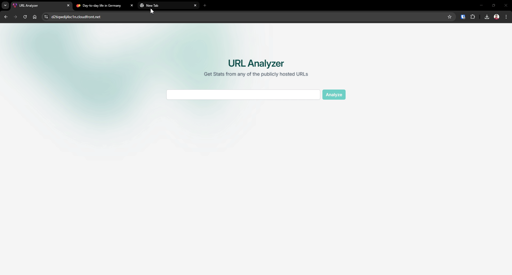

# URL Analyzer - Frontend

<!-- TOC -->
* [URL Analyzer - Frontend](#url-analyzer---frontend)
  * [💻 Local Setup Guide](#-local-setup-guide)
    * [Prerequisites](#prerequisites)
    * [Installation](#installation)
  * [🤙 User Interface](#-user-interface)
  * [🪐 Deployment](#-deployment)
    * [✅ CI/CD](#-cicd)
  * [🔅 Linked Repositories](#-linked-repositories)
  * [☃️ <br>Find Extended / Full Documentation from <br>https://github.com/sendurangr/url-analyzer-api <br> (Backend Readme File)](#-brfind-extended--full-documentation-from-brhttpsgithubcomsendurangrurl-analyzer-api-br-backend-readme-file)
<!-- TOC -->

## 💻 Local Setup Guide

### Prerequisites

- Node.js (v22.x.x)

### Installation

1. Clone the repository:
   ```bash
   git clone https://github.com/sendurangr/url-analyzer-client
   cd url-analyzer-client
    ```

2. Install dependencies:
   ```bash
   npm install
   ```

3. Start the server:
   ```bash
   npm start
   ```

4. The server will start on `localhost:4200` by default.
   Health Check endpoint is available at `http://localhost:4200`

---

## 🤙 User Interface



## 🪐 Deployment

| Services | Endpoints                                             |
|----------|-------------------------------------------------------|
| Frontend | https://d2tiqwdij4sc1n.cloudfront.net                 |
| Backend  | https://8pmmtnd3yw.ap-south-1.awsapprunner.com/health |


### ✅ CI/CD

- The **CI/CD** pipeline is set up using **GitHub Actions**.
- The pipeline is triggered on every push to the `master` branch.
- The pipeline builds the Angular App and push to the s3 then invalidate cloudfront cache <br>
  `GitHub Actions -> AWS S3, Cloudfront`.

## 🔅 Linked Repositories

| Services                        | Repositories                                                                                    |
|---------------------------------|-------------------------------------------------------------------------------------------------|
| Backend - Golang                | https://github.com/sendurangr/url-analyzer-api                                         |
| Deployment Infrastructure - AWS | https://github.com/sendurangr/url-analyzer-infrastructure <br> (Provisioning through Terraform) |
| Frontend - Angular              | https://github.com/sendurangr/url-analyzer-client (Current)                                            |


## ☃️ <br>Find Extended / Full Documentation from <br>https://github.com/sendurangr/url-analyzer-api <br> (Backend Readme File)
